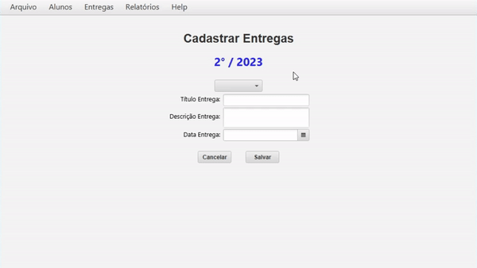
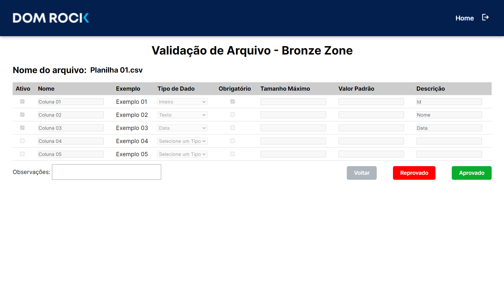
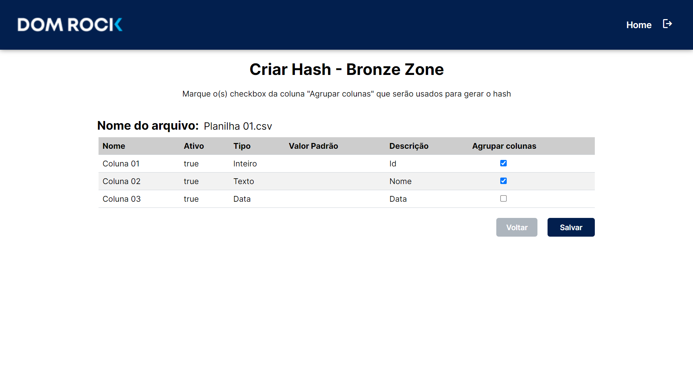
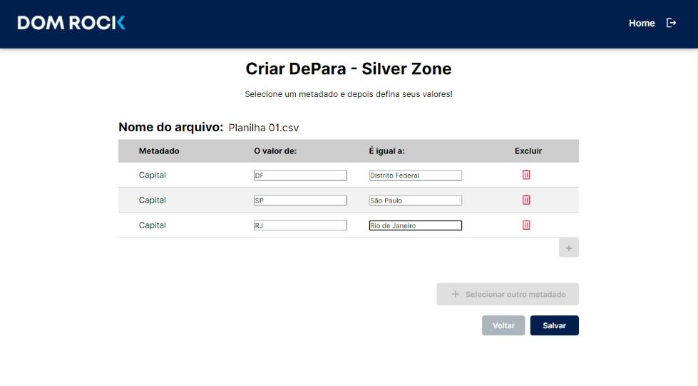

# João Matheus Lamão

## Introdução

Me chamo João Matheus Lamão. Tenho 21 anos e sou desenvolvedor backend com foco em aplicações escaláveis e integráveis. Atualmente curso o tecnólogo em Banco de Dados na Fatec São José dos Campos e sou técnico em Desenvolvimento de Sistemas pela Etec. Tenho experiência profissional como desenvolvedor backend utilizando Golang, além de ter atuado com Java (Spring Boot) em projetos acadêmicos e corporativos. Já participei do desenvolvimento de aplicações SaaS voltadas para integração entre sistemas no varejo (B2C e B2B), lidando com grandes volumes de dados e eventos em tempo real.

Sou responsável pelo deploy automático de aplicações em ambientes Linux utilizando GitHub Actions e AWS EC2, além de dominar conceitos como filas de mensagens (Kafka), cache (Redis) e bancos relacionais e não relacionais. Acredito na importância de escrever código limpo, escalável e bem testado, sempre buscando soluções eficazes que tragam valor ao negócio.

## Contatos

* [GitHub](https://github.com/JoaoMatheusLamao)
* [LinkedIn](https://www.linkedin.com/in/joaomatheuslamao/)

## Meus Principais Conhecimentos

Atuo majoritariamente no backend, utilizando Golang para desenvolvimento de APIs e serviços voltados à integração entre sistemas. Tenho sólida experiência em:

* **Desenvolvimento Backend**: APIs REST em Go (Gorilla Mux, Gin) e Java (Spring Boot), com foco em performance, escalabilidade e segurança.
* **Mensageria e Dados em Tempo Real**: Uso de Kafka para processamento assíncrono e comunicação entre microsserviços.
* **Banco de Dados**: Projeto e modelagem de banco de dados relacionais (PostgreSQL, MySQL, Oracle) e NoSQL (MongoDB, Redis), incluindo otimização de consultas e uso de índices.
* **DevOps e Deploy**: Automatização de deploys via GitHub Actions, hospedagem em AWS EC2, configuração de ambientes Linux e uso de Docker.
* **Cache e Performance**: Implementação de Redis em aplicações Spring Boot para otimizar tempo de resposta e reduzir carga no banco.
* **Geolocalização e Mapas**: Uso de Oracle Spatial e ferramentas de visualização como MapTiler integradas em aplicações Vue.js.
* **Metodologias Ágeis**: Experiência prática com Scrum em equipes multidisciplinares.

Também participei de projetos acadêmicos e empresariais envolvendo pipelines de dados, com foco em extração, transformação e carga (ETL), e contribuí para a criação de uma plataforma web para gerar arquivos de configuração de pipelines, integrando front-end em Vue.js com backend em Spring Boot.

## Meus Projetos

### Em 2023-1

### Empresa Parceira 🫱🏻‍🫲🏻

Este projeto foi desenvolvido durante o primeiro semestre da Fatec, com o professor Lucas Nadalete atuando como cliente interno. O objetivo era construir um sistema de avaliação 360°, utilizado em contextos educacionais e corporativos para medir o desempenho de integrantes de times, com avaliações realizadas por colegas, líderes e autoavaliação.

### Problema ‼️

Antes da solução, o processo era feito manualmente e apresentava os seguintes desafios:

* Dificuldade na unificação dos dados avaliativos
* Critérios de avaliação inconsistentes
* Processo moroso e propenso a erros
* Resultados pouco visuais e de difícil interpretação

### Solução Entregue ✅

Desenvolvemos um sistema interativo em Python, operando via terminal, que automatizou o processo de avaliação com recursos como:

* Interface no terminal com menus organizados e uso de cores para facilitar a navegação
* Avaliação baseada na escala Likert, com critérios padronizados
* Controle de usuários, incluindo diferenciação entre administradores e usuários comuns
* Gestão de turmas, times e sprints com estrutura hierárquica (turma → time → usuário)
* Armazenamento dos dados em arquivos JSON
* Geração de relatórios de desempenho individuais e dashboards com dados consolidados das sprints
* Projeto guiado por metodologia ágil com backlog estruturado e entregas por sprint

O sistema foi planejado com uma abordagem modular, o que permitiu o desenvolvimento incremental conforme o backlog, e incluiu até mesmo a criação de um fluxograma para visualizar a arquitetura do programa.

Repositório: [Clique aqui](https://github.com/iNineBD/Aval360-1Sem2023)

#### Tecnologias Utilizadas

* **Python**: Linguagem de programação interpretada e de alto nível, escolhida como base do projeto por sua clareza, simplicidade e excelente suporte para scripts e automações de linha de comando.

* **JSON (JavaScript Object Notation)**: Utilizado como formato principal para armazenamento de dados estruturados, permitindo persistência local e leitura eficiente de informações do sistema.

* **Git/GitHub**: Empregados para controle de versão e colaboração entre os integrantes do time, garantindo rastreamento das alterações no código-fonte e integração contínua durante o desenvolvimento.

* **Monday.com**: Plataforma de gerenciamento de projetos utilizada para organizar o backlog, distribuir tarefas, acompanhar o progresso por sprint e garantir alinhamento com a metodologia ágil adotada.

* **Terminal (CLI)**: Toda a interação com o sistema foi realizada via interface de linha de comando, utilizando menus e mensagens interativas com destaque visual por meio de cores e formatação no console.

* **Discord**: Ferramenta de comunicação central da equipe, utilizada para reuniões de alinhamento, discussões técnicas e acompanhamento das entregas ao longo das sprints.

### Contribuições Pessoais

Durante o projeto atuei como dev-team, com foco na lógica de negócio, persistência de dados, construção de fluxos de análise e visualização, além da revisão contínua do código da equipe:

* **Elaboração dos Fluxogramas de Lógica do Sistema**  
  

    Fui responsável por elaborar os fluxogramas que representam o comportamento e a navegação do sistema. Esses diagramas foram essenciais para alinhar a equipe quanto ao fluxo de dados, hierarquia de usuários (admin x comum) e ações permitidas em cada etapa do processo de avaliação.

    [Clique aqui](https://github.com/iNineBD/Aval360-1Sem2023/wiki/Sprint-1-iNine)
  

* **Desenvolvimento de Funções Genéricas para Manipulação de Dados (JSON)**  
  

    Implementei funções reutilizáveis para leitura, escrita, atualização e remoção de dados armazenados em arquivos JSON, que atuaram como nosso banco de dados local. Essa camada de abstração facilitou o uso consistente dos dados em todo o sistema, promovendo reutilização de código e evitando duplicação de lógica.
  

* **Criação do Dashboard para Usuários Integrantes**  
  

    Desenvolvi dashboards no terminal que permitem ao integrante visualizar seu desempenho de forma segmentada. Cada usuário pode acessar:
    - Um painel com seu desempenho individual
    - Um painel consolidado com os dados do time ao qual pertence  
    Esses painéis são gerados a partir dos dados das sprints avaliativas e foram importantes para garantir transparência e acompanhamento da evolução do time.

    
  

* **Correção de Bugs e Revisão de Código (PRs)**  
  

    Atuei ativamente como revisor técnico das pull requests no repositório do projeto. Realizei testes funcionais e manuais para garantir que as implementações estivessem de acordo com os requisitos definidos, corrigindo bugs e sugerindo melhorias no código. Essa função foi essencial para manter a integridade do sistema e evitar regressões durante o ciclo de desenvolvimento.
  

#### Hard Skills

* **Python** – Desenvolvi toda a lógica da aplicação em Python, incluindo a estrutura de dados, fluxos de autenticação, cálculos de avaliação e geração de dashboards interativos no terminal.

* **JSON** – Utilizei arquivos JSON como base de dados para simular um sistema de persistência não relacional, criando funções genéricas reutilizáveis para leitura, escrita, atualização e exclusão de dados.

* **VS Code** – Utilizei o Visual Studio Code como principal ambiente de desenvolvimento, com domínio na configuração de extensões, organização de arquivos e produtividade com atalhos e plugins.

* **Git/GitHub** – Gerenciei o versionamento do código com Git, utilizando branches para novas features, revisão de pull requests da equipe e resolução de conflitos de forma eficaz.

* **Monday.com** – Acompanhei o progresso do projeto por meio do Monday, aplicando práticas de Scrum para organização das entregas, priorização de user stories e distribuição de tarefas.

* **Discord** – Utilizei como canal principal de comunicação da equipe, participando ativamente de reuniões remotas, discussões técnicas e decisões sobre arquitetura e responsabilidades do time.

---

#### Soft Skills

* **Comunicação** – Atuei com clareza e objetividade nas interações com a equipe, esclarecendo dúvidas, revisando implementações e contribuindo para decisões de lógica e estrutura do sistema.

* **Trabalho em equipe** – Colaborei na divisão de tarefas, revisão de código e integração de funcionalidades, mantendo um fluxo constante de apoio e troca com os colegas durante todo o projeto.

* **Organização** – Mantive o controle das minhas tarefas e entregas utilizando o Monday e GitHub, garantindo consistência nos commits, histórico limpo e documentação do código bem estruturada.

* **Adaptabilidade** – Reestruturei trechos importantes do sistema quando houve mudanças nos critérios de avaliação definidos pelo cliente interno, adaptando o código sem comprometer a integridade da aplicação.

* **Resolução de problemas** – Identifiquei e corrigi bugs relacionados ao armazenamento e leitura dos dados em JSON, garantindo que os cálculos e dashboards fossem precisos e confiáveis.

* **Atenção aos detalhes (QA)** – Atuei como revisor técnico de pull requests, realizando testes manuais e validações para assegurar que novas funcionalidades estivessem corretas, funcionando conforme o esperado e alinhadas aos requisitos do backlog.

---

### Em 2023-2

### Empresa Parceira 🫱🏻‍🫲🏻

Este projeto foi desenvolvido no segundo semestre da Fatec São José dos Campos, com foco em resolver os desafios enfrentados pelo curso de Análise e Desenvolvimento de Sistemas no gerenciamento de Trabalhos de Graduação (TGs). O professor Emanuel Mineda foi o P1 e cliente A ausência de uma ferramenta prática e eficiente para acompanhar o progresso dos alunos dificultava a organização, a centralização das informações e o controle das etapas do processo.

### Problema ‼️

Antes da solução, o gerenciamento dos TGs apresentava os seguintes obstáculos:

* Ausência de um sistema centralizado para acompanhamento dos alunos e orientadores  
* Dificuldade na organização das entregas e prazos  
* Falta de relatórios confiáveis para acompanhamento e tomada de decisão  
* Processo manual e sujeito a erros de controle e registro  

### Solução Entregue ✅

Desenvolvemos o **Sistema Gerenciador de TGs (SGTGs)**, uma aplicação desktop em Java integrada a um banco de dados MySQL, que centralizou toda a gestão de TGs, permitindo:  

* Importação de dados de alunos, orientadores e TGs via arquivo CSV  
* Cadastro de entregas com validação de dados e prevenção de erros  
* Gestão completa de alunos, orientadores, trabalhos e entregas em um único sistema  
* Relatórios de acompanhamento para monitorar progresso e prazos  
* Tela de **Aptos a Defender**, listando automaticamente apenas os alunos que cumpriram todos os requisitos no semestre  
* Registro de notas, agendamento de bancas e consolidação dos resultados  

O sistema trouxe mais organização e confiabilidade, automatizando tarefas que antes eram realizadas manualmente.  

Repositório: [Clique aqui](https://github.com/iNineBD/SGTG-2Sem2023)

#### Tecnologias Utilizadas

* **Java**: Linguagem principal para o desenvolvimento da aplicação desktop.  
* **Eclipse IDE**: Ambiente de desenvolvimento utilizado para estruturar e organizar o projeto.  
* **MySQL**: Banco de dados relacional para armazenamento seguro e estruturado das informações de alunos, orientadores e entregas.  
* **Scene Builder (JavaFX)**: Ferramenta para construção da interface gráfica da aplicação.  
* **Figma**: Utilizado para prototipação das telas e definição do design da interface.  
* **ClickUp**: Plataforma de gerenciamento de tarefas para acompanhamento de backlog, divisão de atividades e organização das entregas.  

### Contribuições Pessoais

Durante o projeto atuei como desenvolvedor, com foco na implementação de funcionalidades-chave ligadas à gestão de entregas e relatórios:

* **Importação e Confirmação de Dados via CSV**  
  
  
  Desenvolvi a tela de confirmação dos dados dos alunos, carregados a partir da função “Carregar CSV”. Esse processo permitiu validar e inserir as informações no banco de forma estruturada.  
  
  

* **Cadastro de Entregas**  
  
  
  Implementei a funcionalidade de cadastramento de entregas, acessível pela barra superior em “Entregas → Nova Entrega”.  
  A tela inclui filtros de validação para prevenir erros e, após o cadastro, os dados são salvos diretamente no banco de dados e exibidos em “Visualizar Entregas”.

    
  
  

* **Relatório “Aptos a Defender”**  
  
  
  Desenvolvi o relatório que lista apenas os alunos aptos a defender seus TGs, com base no cumprimento de todas as entregas do semestre. Essa funcionalidade foi essencial para apoiar a coordenação e professores na organização das bancas.

  <video src="sources/2sem2.mp4" controls width="600"></video>
  
  

#### Hard Skills

* **Java** – Desenvolvimento de funcionalidades de back-end e front-end na aplicação desktop.  
* **MySQL** – Estruturação de tabelas e persistência dos dados relacionados a alunos, orientadores, entregas e notas.  
* **JavaFX + Scene Builder** – Criação e customização das telas da aplicação com foco em usabilidade.  
* **Git/GitHub** – Controle de versão, organização de branches e integração com a equipe.  
* **Figma** – Participação no design inicial e prototipação da interface gráfica.  
* **ClickUp** – Organização e acompanhamento das tarefas seguindo uma metodologia ágil.  

#### Soft Skills

* **Comunicação** – Atuei com clareza no alinhamento das funcionalidades junto à equipe, garantindo consistência no desenvolvimento.  
* **Trabalho em equipe** – Colaborei ativamente na integração entre banco de dados e interface, compartilhando conhecimento técnico e apoiando colegas.  
* **Organização** – Mantive o fluxo de commits limpo e documentado, além de estruturar bem o código para fácil manutenção.  
* **Resolução de problemas** – Desenvolvi mecanismos de validação e prevenção de erros no cadastro de entregas, assegurando confiabilidade no sistema.  
* **Atenção aos detalhes** – Trabalhei em relatórios específicos (como o de aptos a defender), cuidando da precisão lógica e da exibição clara das informações.  

---

### Em 2024-1

### Empresa Parceira 🫱🏻‍🫲🏻

Este projeto foi desenvolvido em parceria com a empresa **Dom Rock**, que possui um sistema de processamento de dados em cascata chamado **pipeline**, composto por múltiplos estágios. O funcionamento da plataforma depende de configurações adequadas das fontes de dados, que até então eram realizadas de forma manual. Esse processo gerava grande consumo de tempo e alta dependência de especialistas técnicos, tornando a implantação menos ágil para os clientes.

### Problema ‼️

O processo de configuração manual das fontes de dados apresentava os seguintes problemas:

* Alto consumo de tempo dos técnicos da Dom Rock  
* Dependência excessiva de especialistas para configurações simples  
* Processo propenso a erros devido à falta de padronização  
* Dificuldade em oferecer maior autonomia para clientes e usuários não técnicos  

### Solução Entregue ✅

Foi desenvolvido o **DataFlow**, uma plataforma web para automatizar e simplificar a configuração das fontes de dados em diferentes estágios do pipeline, permitindo maior agilidade na implantação e reduzindo a dependência de técnicos especializados.  

O sistema atendeu os principais requisitos do cliente, incluindo:  

* Cadastro de clientes, soluções e usuários autorizados  
* Interface para upload de dados CSV ou Excel, exibindo a estrutura (campos, tipos, regras de nulidade e descrições)  
* Definição de chaves de identificação dos dados  
* Interface “De/Para” para aplicação de regras comuns (ex.: mapear tipo de movimento 802 = transferência de estoque)  
* Dashboard administrativo com visão quantitativa (clientes, tipos de fontes de dados, quantidade de campos, etc.)  
* Visão analítica consolidada das configurações realizadas  

O produto final contemplava o controle de **3 fases da ingestão de dados**: **Landing Zone**, **Bronze Zone** e **Silver Zone**, cada uma com telas específicas:  

* **Validação Bronze Zone** – O usuário responsável aprova ou reprova os dados processados nessa etapa.  
* **Bronze Zone (Agrupamento de Colunas)** – Permite ao usuário agrupar colunas relacionadas para identificar chaves de registros.  
* **Silver Zone (Criar De/Para)** – O usuário seleciona um metadado e atribui valores relacionados. Após a configuração, o metadado deixa de aparecer disponível para seleção, garantindo consistência.  

Repositório: [Clique aqui](https://github.com/iNineBD/DataFlow)

#### Tecnologias Utilizadas

* **Java (Spring Boot)** – Implementação do back-end, garantindo escalabilidade e integração com a lógica de negócio.  
* **IntelliJ IDEA** – IDE principal para desenvolvimento back-end.  
* **Vue.js (HTML5, CSS, JavaScript)** – Construção do front-end responsivo e dinâmico.  
* **VS Code** – IDE utilizada para o desenvolvimento front-end.  
* **Figma** – Criação de protótipos e definição de interface de usuário.  
* **ClickUp** – Organização de backlog, tarefas e acompanhamento ágil do projeto.  
* **Discord** – Canal de comunicação principal para reuniões e discussões técnicas.  
* **Slack** – Utilizado para alinhamento adicional e comunicação com stakeholders.  
* **Stack Overflow** – Fonte de pesquisa e suporte técnico durante o desenvolvimento.  

### Contribuições Pessoais

Atuei como desenvolvedor no projeto, com foco na implementação das funcionalidades que controlavam as diferentes fases da ingestão de dados:

* **Tela de Validação Bronze Zone**  
  
  
  Implementei a lógica e interface para que o responsável pudesse aprovar ou reprovar os dados processados nesta etapa, garantindo controle de qualidade.

  
  
  

* **Tela Bronze Zone (Agrupamento de Colunas)**  
  
  
  Desenvolvi a funcionalidade que permite relacionar colunas entre si, possibilitando a criação de chaves de identificação dos registros. Essa tela foi essencial para estruturar os dados de forma consistente.  

  
  
  

* **Tela Criar De/Para – Silver Zone**  
  
  
  Implementei a tela de configuração de metadados, permitindo ao usuário atribuir valores específicos. Após a configuração, o metadado deixa de aparecer para seleção, evitando duplicidade.
  
    
  
  

#### Hard Skills

* **Java (Spring Boot)** – Desenvolvimento back-end robusto para atender às regras de negócio.  
* **Vue.js (HTML5, CSS, JavaScript)** – Criação de interfaces interativas e responsivas.  
* **MySQL (conceitual e integração)** – Apoio na modelagem e integração dos dados processados pelo sistema.  
* **Git/GitHub** – Controle de versão com branches, PRs e integração contínua.  
* **Figma** – Prototipação de telas e definição da experiência do usuário.  
* **ClickUp** – Organização de backlog e acompanhamento das sprints.  

#### Soft Skills

* **Comunicação** – Interação constante com a equipe e stakeholders para validar requisitos e entregas.  
* **Trabalho em equipe** – Integração das funcionalidades entre front-end e back-end, colaborando ativamente no desenvolvimento incremental.  
* **Organização** – Estruturação de código e commits de forma clara e padronizada.  
* **Resolução de problemas** – Implementação de soluções para validação de dados e consistência das regras de negócio.  
* **Adaptabilidade** – Atuação em múltiplas frentes (back-end, front-end e design de interface) conforme a necessidade do time.  

### Em 2024-2

### Empresa Parceira 🫱🏻‍🫲🏻

A empresa parceira enfrentava o desafio de armazenar e consultar dados de geolocalização em tempo real, continuamente gerados por dispositivos IoT como wearables, tags e smartphones. Esses dados são essenciais para o monitoramento de pessoas e ativos, exigindo um sistema capaz de lidar com grandes volumes de informações de forma escalável, confiável e segura.

### Problema ‼️

O cenário atual apresentava as seguintes dificuldades:

* Grande volume de dados de geolocalização gerados continuamente  
* Necessidade de armazenar e consultar informações em tempo real  
* Falta de automação na gestão e configuração desses dados  
* Dependência de técnicos especializados para manter a operação  
* Baixa eficiência no monitoramento e rastreamento de pessoas e ativos  

### Solução Entregue ✅

Para enfrentar esses obstáculos, foi proposta a criação de uma plataforma especializada na gestão e configuração de dados de geolocalização em tempo real. Esta solução permite à empresa:

* Automatizar a gestão dos dados de geolocalização  
* Acelerar a implantação das operações  
* Garantir a integridade, consistência e segurança das informações  
* Reduzir a dependência de profissionais técnicos  
* Otimizar o monitoramento de pessoas, ativos e dispositivos em tempo real  

A plataforma desenvolvida possui funcionalidades que atendem aos requisitos principais, incluindo:

* Identificação de pontos de parada de um dispositivo em um intervalo de tempo  
* Consulta baseada em usuário, dispositivo e período  
* Consulta aprimorada com filtragem por múltiplos usuários  
* Visualização geográfica dos resultados em mapa interativo  
* Interface de login e cadastro para controle de autenticação  
* Mapeamento de rotas e player interativo para análise dinâmica dos deslocamentos  

#### Tecnologias Utilizadas

* **Java (Spring Boot)** – Estrutura principal do back-end.  
* **Vue.js** – Construção do front-end interativo.  
* **Node.js** – Suporte a funcionalidades auxiliares e serviços.  
* **Oracle** – Banco de dados para armazenamento dos dados geográficos.  
* **Docker** – Conteinerização e padronização do ambiente.  

### Contribuições Pessoais

Atuei como desenvolvedor no projeto, responsável pela implementação de funcionalidades essenciais para o processamento e visualização dos dados de geolocalização:

* **Pontos de Parada**  
  
  
  Desenvolvi a lógica e a interface para identificar pontos em que um dispositivo permanece em uma mesma área por mais de 15 minutos, representados por “Marcadores”.  

  A tela inicial apresenta um mapa acompanhado de uma aba lateral com opções de **Home** e **Filtrar**. Na área de filtros, o usuário pode realizar buscas por:  
  * Usuário  
  * Dispositivo  
  * Período  

  Após selecionar o usuário, dispositivo associado e intervalo de datas, o sistema exibe um ou vários pontos de parada referentes ao dispositivo em determinado período.
  
  
  

* **Múltiplos Usuários**  
  
  
  Aprimorei o sistema de busca, permitindo a seleção simultânea de vários usuários.  

  Com isso, tornou-se possível comparar diferentes trajetos, analisar padrões e enriquecer a experiência visual das consultas, tornando o sistema mais flexível e robusto.  

  
  

* **Login e Cadastro**  
  
  
  Implementei uma nova interface de autenticação com telas modernas e intuitivas, garantindo uma navegação simples e segura.  

  Essa funcionalidade reforçou o controle de acesso e melhorou a experiência do usuário na entrada do sistema.  

  
  

* **Rotas + Player Interativo**  
  
  
  Desenvolvi a funcionalidade de exibição de rotas, fundamentais para analisar deslocamentos e trajetos.  

  Além disso, implementei um player interativo que permite simular o movimento ao longo das rotas, com opções de pausar, ajustar velocidade e navegar entre pontos específicos.  

  Essa funcionalidade tornou a análise espacial muito mais dinâmica, moderna e intuitiva.  

  
  

#### Hard Skills

* **Java (Spring Boot)** – Construção de APIs e lógica de negócio.  
* **Vue.js** – Desenvolvimento de interfaces interativas e responsivas.  
* **Node.js** – Implementação de serviços auxiliares.  
* **Oracle** – Modelagem e integração com banco de dados.  
* **Docker** – Conteinerização de serviços.  
* **Git/GitHub** – Controle de versão e organização de branches.  

#### Soft Skills

* **Comunicação** – Participação ativa em discussões técnicas e alinhamentos.  
* **Trabalho em equipe** – Integração constante com membros de front-end e back-end.  
* **Organização** – Manutenção de código limpo e padronizado.  
* **Resolução de problemas** – Solução de desafios relacionados à manipulação de dados geográficos.  
* **Adaptabilidade** – Atuação em múltiplas frentes e aprendizado contínuo de tecnologias.  

### Em 2025-1

### Empresa Parceira 🫱🏻‍🫲🏻

A **Youtan**, empresa especializada em desenvolvimento de software, buscava aprimorar sua gestão de projetos utilizando a plataforma Taiga. Contudo, a equipe enfrentava dificuldades na visualização de indicadores essenciais do fluxo de trabalho, o que prejudicava o acompanhamento do progresso dos projetos e dificultava a tomada de decisões estratégicas.

Além disso, a plataforma não oferecia nativamente um sistema robusto de diferenciação de acesso por níveis de usuário, impedindo a exibição de informações personalizadas para operadores, gestores e administradores.

### Problema ‼️

A empresa enfrentava os seguintes desafios:

* Ausência de um painel centralizado de indicadores estratégicos  
* Dificuldade para visualizar métricas como:  
  * Quantidade de cards criados por período  
  * Tempo médio de finalização  
  * Distribuição de tarefas por colaborador  
* Falta de diferenciação de acesso por tipo de usuário  
* Pouca transparência na gestão e análise do fluxo de trabalho  
* Processo de tomada de decisão prejudicado pela baixa visibilidade de dados  

### Solução Entregue ✅

A solução entregue consistiu no desenvolvimento de uma **plataforma integrada ao banco de dados do Taiga**, responsável por consolidar e exibir indicadores estratégicos sobre o andamento e produtividade dos times.

A plataforma permite diferentes níveis de acesso:

* **Operador** – Visualiza apenas seus próprios indicadores  
* **Gestor** – Visualiza seus indicadores e os do seu time  
* **Admin** – Acompanha todos os indicadores de todos os times  

Além disso, foi desenvolvido um conjunto de **dashboards interativos**, permitindo análises detalhadas e facilitando o acompanhamento dos projetos de forma clara e objetiva.

#### Tecnologias Utilizadas

* **Figma** – Prototipação e design de interface  
* **Java / Spring** – Back-end e lógica de negócios  
* **Python** – Suporte e cálculos específicos de indicadores  
* **PostgreSQL** – Armazenamento estruturado dos dados  
* **Postman** – Testes de API  
* **Vue.js / TypeScript / JavaScript / HTML5** – Construção da interface web  
* **Visual Studio Code** – IDE principal para desenvolvimento front-end  
* **Jira Software** – Organização de backlog e acompanhamento ágil  
* **Discord** – Comunicação da equipe  

### Contribuições Pessoais

Atuei como desenvolvedor responsável pela implementação de diversos indicadores, funcionalidades analíticas e controles de acesso da plataforma:

* **US01 – Indicadores por Etiqueta**  
  
  
  Desenvolvi um painel que exibe a quantidade de cards categorizados por etiqueta, permitindo identificar rapidamente quais categorias possuem maior volume de tarefas.

  
  

* **US02 – Indicadores Temporais**  
  
  
  Implementei visualizações relacionadas ao tempo de criação e finalização dos cards, adicionando filtros de período como último dia, semana e mês.

  
  

* **US03 – Indicadores por Status**  
  
  
  Adicionei gráficos que mostram a distribuição dos cards pelos status do fluxo Kanban (A Fazer, Em Andamento, Concluído).

  
  

* **US04 – Indicadores de Tempo Médio por Card**  
  
  
  Desenvolvi o cálculo automático do tempo médio gasto desde a criação até a finalização dos cards, permitindo a análise de eficiência do time.

  
  

* **US05 – Indicadores por Colaborador**  
  
  
  Implementei visualizações que permitem gestores e administradores acompanharem a produtividade individual de cada membro da equipe.

  
  

* **US06 – Indicadores por Time**  
  
  
  Desenvolvi a visão administrativa que exibe os indicadores consolidados de todos os times, possibilitando análises estratégicas.

  
  

* **US07 – Autenticação de Usuário**  
  
  
  Criei o sistema de login com autenticação segura, garantindo que somente usuários autorizados possam acessar a plataforma.

  
  

* **US08 – Gerenciamento de Contas de Usuário**  
  
  
  Desenvolvi a área administrativa para criação, edição e exclusão de contas, além de controle de permissões.

  
  

* **US09 – Indicadores do Operador**  
  
  
  Criei a visão dedicada ao operador, exibindo apenas seus indicadores individuais.

  
  

* **US10 – Indicadores de Retrabalho**  
  
  
  Implementei a visualização de retrabalho, permitindo identificar tarefas refeitas e analisá-las como métrica de eficiência.

  
  

* **US11 – User Stories por Sprint**  
  
  
  Desenvolvi um painel que exibe a quantidade de user stories por sprint, facilitando a análise de capacidade e planejamento.

  
  

* **US12 – Exportação de Indicadores em CSV**  
  
  
  Implementei um recurso de exportação dos indicadores para arquivo CSV, permitindo análises externas e armazenamento offline.

  
  

#### Hard Skills

* **Java (Spring Boot)** – Desenvolvimento de APIs e lógica de negócio  
* **Python** – Manipulação e análise de dados  
* **Vue.js / TypeScript** – Criação de interfaces modernas e reativas  
* **HTML5 / JavaScript** – Estruturação e dinamicidade do front-end  
* **PostgreSQL** – Modelagem e consultas avançadas  
* **Git/GitHub** – Controle de versão e fluxo colaborativo  
* **Figma** – Estruturação visual e prototipação  

#### Soft Skills

* **Comunicação** – Interação constante com equipe e stakeholders  
* **Trabalho em equipe** – Colaboração ativa no desenvolvimento integrado  
* **Organização** – Estruturação clara de código e documentação  
* **Resolução de problemas** – Criação de soluções eficientes para métricas complexas  
* **Adaptabilidade** – Atuação em múltiplas frentes técnicas e de negócio  

### Em 2025-2

### Empresa Parceira 🫱🏻‍🫲🏻

A **Pro4tech** identificou uma oportunidade estratégica em seu extenso histórico de tickets de suporte. No entanto, esses dados estavam desorganizados e sem estrutura, tornando impossível aproveitá-los de forma eficiente. Essa falta de organização gerava um ciclo de retrabalho: a equipe perdia tempo procurando soluções já existentes, e a liderança deixava de extrair insights valiosos para orientar decisões estratégicas.

Existia a necessidade de transformar esse “conhecimento estagnado” em um ativo acessível, pesquisável e capaz de gerar valor real para a empresa.

### Problema ‼️

A empresa enfrentava os seguintes desafios:

* Grande volume de tickets antigos sem organização  
* Dificuldade para localizar soluções já registradas anteriormente  
* Falta de uma base de conhecimento estruturada e pesquisável  
* Retrabalho constante por parte da equipe de suporte  
* Ausência de indicadores e insights sobre recorrência de problemas  
* Impossibilidade de prever tendências ou antecipar falhas operacionais  

### Solução Entregue ✅

A solução proposta foi o desenvolvimento de um **sistema inteligente** capaz de transformar dados brutos e não estruturados dos tickets em uma base de conhecimento organizada e facilmente consultável.

A plataforma oferece:

* **Busca vetorizada (semantic search)** utilizando similaridade semântica  
* **Organização automática dos tickets** por relevância e contexto  
* **Acesso rápido a soluções de problemas recorrentes**  
* **Dashboards e métricas inteligentes** para auxiliar a gestão na tomada de decisões  
* **Sistema de login com controle de acesso e auditoria**  
* **Previsão de problemas e identificação de tendências** com base no histórico  

A combinação de motor semântico + painel de insights transforma os tickets antigos da empresa em uma poderosa fonte de conhecimento, aumentando a eficiência operacional e reduzindo custos.

#### Tecnologias Utilizadas

* **Elasticsearch** – Motor de busca vetorizada e indexação inteligente  
* **Golang** – Implementação do back-end de alta performance  
* **Python** – Processamento, vetorização e análises inteligentes  
* **Vue.js / Nuxt** – Desenvolvimento do front-end dinâmico  
* **Oracle** – Armazenamento estruturado de dados  
* **Visual Studio Code** – Ambiente principal de desenvolvimento  
* **Jira Software** – Organização do backlog e acompanhamento do projeto  

### Contribuições Pessoais

Durante o projeto, atuei diretamente na implementação de funcionalidades essenciais para transformar o histórico de tickets em um sistema inteligente e pesquisável.

* **Painel com os Tickets – Busca Vetorizada**  
  
  
  Desenvolvi a integração da **busca vetorizada (semantic search)** no painel de tickets, permitindo que o usuário encontre resultados com base no **significado** da consulta, e não apenas por palavras exatas.

  Isso tornou a pesquisa muito mais intuitiva e eficaz, mesmo para tickets antigos, incompletos ou escritos com terminologias diferentes.

  
  

* **Sistema de Login (JWT + Controle de Acesso)**  
  
  
  Implementei o sistema completo de autenticação utilizando **JWT (JSON Web Token)**, garantindo segurança no acesso e proteção das informações.

  Minhas entregas incluíram:  
  * Criação do fluxo de login e logout com tokens  
  * Definição de níveis de acesso (usuário comum e administrador)  
  * Controle de sessão  
  * Integração com o módulo de auditoria para registrar eventos de autenticação  

  
  

#### Hard Skills

* **Golang** – Desenvolvimento back-end performático  
* **Elasticsearch** – Implementação de busca vetorial/semântica  
* **Vue.js / Nuxt** – Criação de interfaces modernas  
* **Python** – Processamento e vetorização de dados  
* **Oracle** – Integração com banco de dados e modelagem  
* **Git/GitHub** – Controle de versão e organização do código  
* **JWT** – Implementação de autenticação segura  

#### Soft Skills

* **Comunicação** – Colaboração próxima com analistas, devs e stakeholders  
* **Trabalho em equipe** – Desenvolvimento conjunto e integração entre módulos  
* **Organização** – Estruturação de código, commits e documentação clara  
* **Resolução de problemas** – Implementação de soluções avançadas de busca  
* **Adaptabilidade** – Rapidez no aprendizado de novas tecnologias e frameworks  
