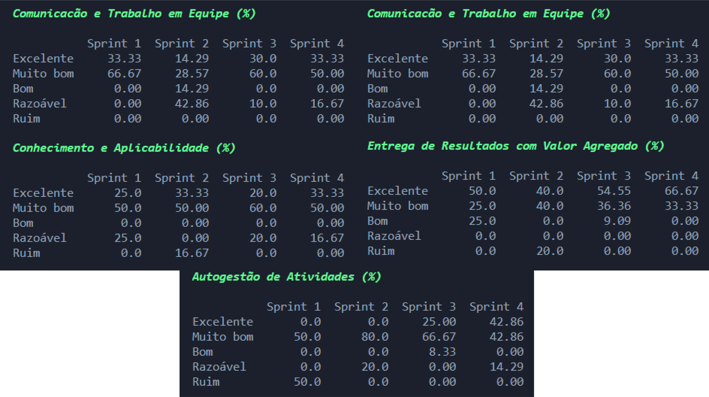

# João Matheus Lamão

## Introdução

Me chamo João Matheus Lamão. Tenho 21 anos e sou desenvolvedor backend com foco em aplicações escaláveis e integráveis. Atualmente curso o tecnólogo em Banco de Dados na Fatec São José dos Campos e sou técnico em Desenvolvimento de Sistemas pela Etec. Tenho experiência profissional como desenvolvedor backend utilizando Golang, além de ter atuado com Java (Spring Boot) em projetos acadêmicos e corporativos. Já participei do desenvolvimento de aplicações SaaS voltadas para integração entre sistemas no varejo (B2C e B2B), lidando com grandes volumes de dados e eventos em tempo real.

Sou responsável pelo deploy automático de aplicações em ambientes Linux utilizando GitHub Actions e AWS EC2, além de dominar conceitos como filas de mensagens (Kafka), cache (Redis) e bancos relacionais e não relacionais. Acredito na importância de escrever código limpo, escalável e bem testado, sempre buscando soluções eficazes que tragam valor ao negócio.

## Contatos

* [GitHub](https://github.com/JoaoMatheusLamao)
* [LinkedIn](https://www.linkedin.com/in/joaomatheuslamao/)

## Meus Principais Conhecimentos

Atuo majoritariamente no backend, utilizando Golang para desenvolvimento de APIs e serviços voltados à integração entre sistemas. Tenho sólida experiência em:

* **Desenvolvimento Backend**: APIs REST em Go (Gorilla Mux, Gin) e Java (Spring Boot), com foco em performance, escalabilidade e segurança.
* **Mensageria e Dados em Tempo Real**: Uso de Kafka para processamento assíncrono e comunicação entre microsserviços.
* **Banco de Dados**: Projeto e modelagem de banco de dados relacionais (PostgreSQL, MySQL, Oracle) e NoSQL (MongoDB, Redis), incluindo otimização de consultas e uso de índices.
* **DevOps e Deploy**: Automatização de deploys via GitHub Actions, hospedagem em AWS EC2, configuração de ambientes Linux e uso de Docker.
* **Cache e Performance**: Implementação de Redis em aplicações Spring Boot para otimizar tempo de resposta e reduzir carga no banco.
* **Geolocalização e Mapas**: Uso de Oracle Spatial e ferramentas de visualização como MapTiler integradas em aplicações Vue.js.
* **Metodologias Ágeis**: Experiência prática com Scrum em equipes multidisciplinares.

Também participei de projetos acadêmicos e empresariais envolvendo pipelines de dados, com foco em extração, transformação e carga (ETL), e contribuí para a criação de uma plataforma web para gerar arquivos de configuração de pipelines, integrando front-end em Vue.js com backend em Spring Boot.

## Meus Projetos

### Em 2023-1

### Empresa Parceira 🫱🏻‍🫲🏻

Este projeto foi desenvolvido durante o primeiro semestre da Fatec, com o professor Lucas Nadalete atuando como cliente interno. O objetivo era construir um sistema de avaliação 360°, utilizado em contextos educacionais e corporativos para medir o desempenho de integrantes de times, com avaliações realizadas por colegas, líderes e autoavaliação.

### Problema ‼️

Antes da solução, o processo era feito manualmente e apresentava os seguintes desafios:

* Dificuldade na unificação dos dados avaliativos
* Critérios de avaliação inconsistentes
* Processo moroso e propenso a erros
* Resultados pouco visuais e de difícil interpretação

### Solução Entregue ✅

Desenvolvemos um sistema interativo em Python, operando via terminal, que automatizou o processo de avaliação com recursos como:

* Interface no terminal com menus organizados e uso de cores para facilitar a navegação
* Avaliação baseada na escala Likert, com critérios padronizados
* Controle de usuários, incluindo diferenciação entre administradores e usuários comuns
* Gestão de turmas, times e sprints com estrutura hierárquica (turma → time → usuário)
* Armazenamento dos dados em arquivos JSON
* Geração de relatórios de desempenho individuais e dashboards com dados consolidados das sprints
* Projeto guiado por metodologia ágil com backlog estruturado e entregas por sprint

O sistema foi planejado com uma abordagem modular, o que permitiu o desenvolvimento incremental conforme o backlog, e incluiu até mesmo a criação de um fluxograma para visualizar a arquitetura do programa.

Repositório: [Clique aqui](https://github.com/iNineBD/Aval360-1Sem2023)

#### Tecnologias Utilizadas

* **Python**: Linguagem de programação interpretada e de alto nível, escolhida como base do projeto por sua clareza, simplicidade e excelente suporte para scripts e automações de linha de comando.

* **JSON (JavaScript Object Notation)**: Utilizado como formato principal para armazenamento de dados estruturados, permitindo persistência local e leitura eficiente de informações do sistema.

* **Git/GitHub**: Empregados para controle de versão e colaboração entre os integrantes do time, garantindo rastreamento das alterações no código-fonte e integração contínua durante o desenvolvimento.

* **Monday.com**: Plataforma de gerenciamento de projetos utilizada para organizar o backlog, distribuir tarefas, acompanhar o progresso por sprint e garantir alinhamento com a metodologia ágil adotada.

* **Terminal (CLI)**: Toda a interação com o sistema foi realizada via interface de linha de comando, utilizando menus e mensagens interativas com destaque visual por meio de cores e formatação no console.

* **Discord**: Ferramenta de comunicação central da equipe, utilizada para reuniões de alinhamento, discussões técnicas e acompanhamento das entregas ao longo das sprints.

### Contribuições Pessoais

Durante o projeto atuei como dev-team, com foco na lógica de negócio, persistência de dados, construção de fluxos de análise e visualização, além da revisão contínua do código da equipe:

* **Elaboração dos Fluxogramas de Lógica do Sistema**  
  

    Fui responsável por elaborar os fluxogramas que representam o comportamento e a navegação do sistema. Esses diagramas foram essenciais para alinhar a equipe quanto ao fluxo de dados, hierarquia de usuários (admin x comum) e ações permitidas em cada etapa do processo de avaliação.
    
    [Clique aqui](https://github.com/iNineBD/Aval360-1Sem2023/wiki/Sprint-1-iNine)
  

* **Desenvolvimento de Funções Genéricas para Manipulação de Dados (JSON)**  
  

    Implementei funções reutilizáveis para leitura, escrita, atualização e remoção de dados armazenados em arquivos JSON, que atuaram como nosso banco de dados local. Essa camada de abstração facilitou o uso consistente dos dados em todo o sistema, promovendo reutilização de código e evitando duplicação de lógica.
  

* **Criação do Dashboard para Usuários Integrantes**  
  

    Desenvolvi dashboards no terminal que permitem ao integrante visualizar seu desempenho de forma segmentada. Cada usuário pode acessar:
    - Um painel com seu desempenho individual
    - Um painel consolidado com os dados do time ao qual pertence  
    Esses painéis são gerados a partir dos dados das sprints avaliativas e foram importantes para garantir transparência e acompanhamento da evolução do time.
    
    
  

* **Correção de Bugs e Revisão de Código (PRs)**  
  

    Atuei ativamente como revisor técnico das pull requests no repositório do projeto. Realizei testes funcionais e manuais para garantir que as implementações estivessem de acordo com os requisitos definidos, corrigindo bugs e sugerindo melhorias no código. Essa função foi essencial para manter a integridade do sistema e evitar regressões durante o ciclo de desenvolvimento.
  

#### Hard Skills

* **Python** – Desenvolvi toda a lógica da aplicação em Python, incluindo a estrutura de dados, fluxos de autenticação, cálculos de avaliação e geração de dashboards interativos no terminal.

* **JSON** – Utilizei arquivos JSON como base de dados para simular um sistema de persistência não relacional, criando funções genéricas reutilizáveis para leitura, escrita, atualização e exclusão de dados.

* **VS Code** – Utilizei o Visual Studio Code como principal ambiente de desenvolvimento, com domínio na configuração de extensões, organização de arquivos e produtividade com atalhos e plugins.

* **Git/GitHub** – Gerenciei o versionamento do código com Git, utilizando branches para novas features, revisão de pull requests da equipe e resolução de conflitos de forma eficaz.

* **Monday.com** – Acompanhei o progresso do projeto por meio do Monday, aplicando práticas de Scrum para organização das entregas, priorização de user stories e distribuição de tarefas.

* **Discord** – Utilizei como canal principal de comunicação da equipe, participando ativamente de reuniões remotas, discussões técnicas e decisões sobre arquitetura e responsabilidades do time.

---

#### Soft Skills

* **Comunicação** – Atuei com clareza e objetividade nas interações com a equipe, esclarecendo dúvidas, revisando implementações e contribuindo para decisões de lógica e estrutura do sistema.

* **Trabalho em equipe** – Colaborei na divisão de tarefas, revisão de código e integração de funcionalidades, mantendo um fluxo constante de apoio e troca com os colegas durante todo o projeto.

* **Organização** – Mantive o controle das minhas tarefas e entregas utilizando o Monday e GitHub, garantindo consistência nos commits, histórico limpo e documentação do código bem estruturada.

* **Adaptabilidade** – Reestruturei trechos importantes do sistema quando houve mudanças nos critérios de avaliação definidos pelo cliente interno, adaptando o código sem comprometer a integridade da aplicação.

* **Resolução de problemas** – Identifiquei e corrigi bugs relacionados ao armazenamento e leitura dos dados em JSON, garantindo que os cálculos e dashboards fossem precisos e confiáveis.

* **Atenção aos detalhes (QA)** – Atuei como revisor técnico de pull requests, realizando testes manuais e validações para assegurar que novas funcionalidades estivessem corretas, funcionando conforme o esperado e alinhadas aos requisitos do backlog.
